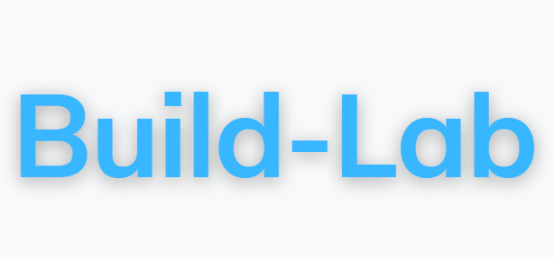
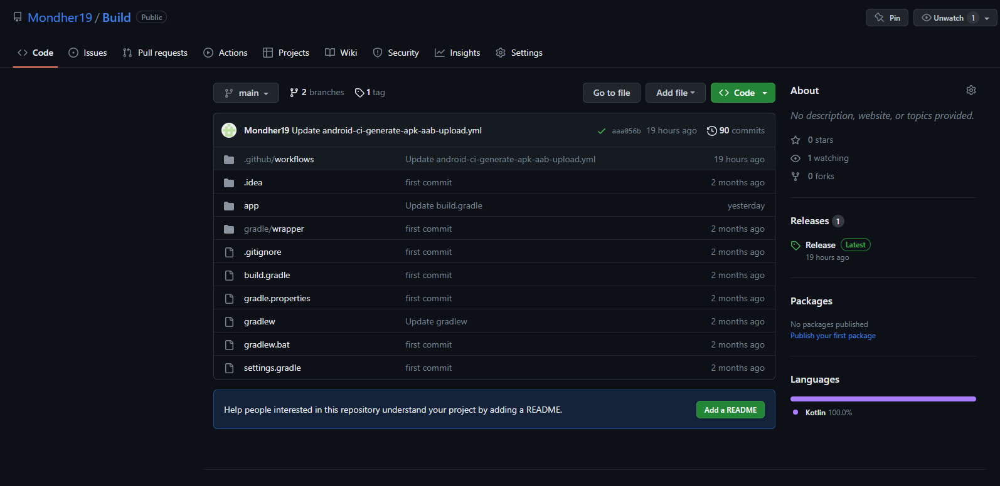
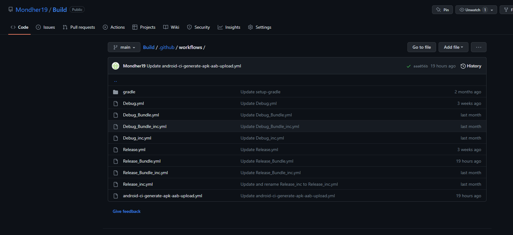
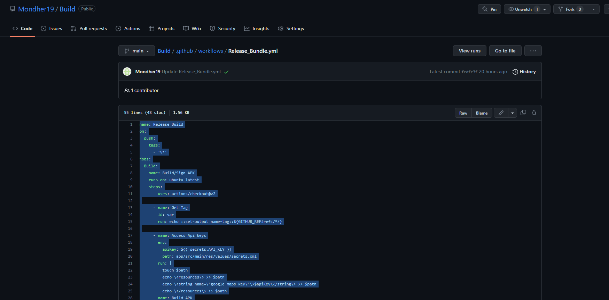
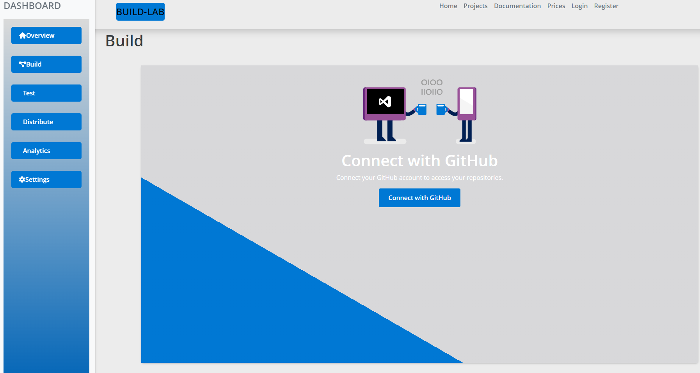
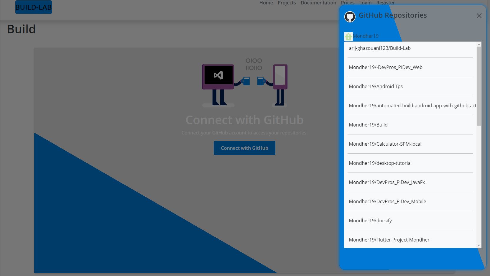
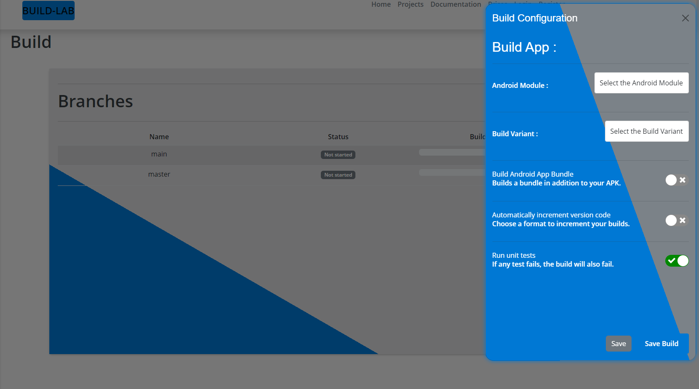
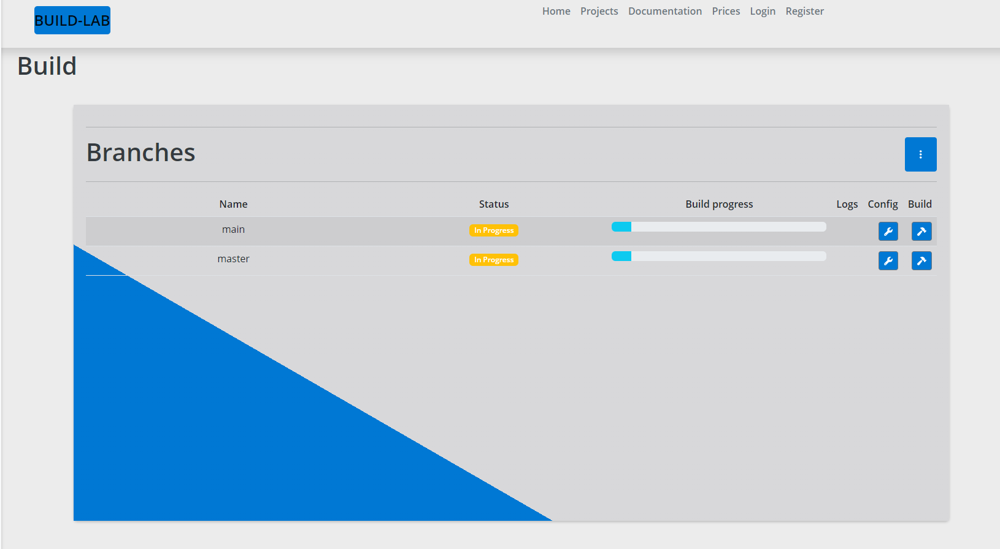

<p align="center">
  <a href="https://docsify.js.org">
    
  </a>
</p>

<p align="center">
  This mobile application is designed to help developers and IT professionals manage their DevOps workflows from their mobile devices
</p>

<p align="center">
  <a href="#backers"></a>
  <a href="#sponsors">
    </a>
  <a href="https://github.com/docsifyjs/docsify/actions/workflows/test.yml"></a>
  <a href="https://www.npmjs.com/package/docsify"></a>
  <a href="https://github.com/QingWei-Li/donate"></a>
  <a href="https://discord.gg/3NwKFyR"></a>
  <a href="https://gitpod.io/#https://github.com/docsifyjs/docsify"></a>
</p>


## Table of Contents

- Features
- Technologies Used
- Installation
- Usage
- Contributing
 -License
 
 
 ## Features
 
- View and manage code repositories
- Manage build and release pipelines
- Monitor application performance and errors
- Receive push notifications for important events
- Collaborate with team members


## Technologies Used

- GitHub API
- Github Workflows
- React
- Node js


#  Build and Sign and Test your Mobile app ( Android / IOS / Flutter )

## Build and Sign and Test Android Application Buil Android Application

- Step 1: Create a Workflow File
The first step is to create a workflow file in your GitHub repository. The workflow file will define the steps that GitHub will take to build your mobile application.

In your GitHub repository, create a new file in the .github/workflows directory. Name the file build.yml.

Copy the following code into the fil:

```html

<script>
name: Release Build
on:
  push:
    tags:
      - 'v*'
jobs:
  Build:
    name: Build/Sign APK
    runs-on: ubuntu-latest
    steps:
      - uses: actions/checkout@v2

      - name: Get Tag
        id: var
        run: echo ::set-output name=tag::${GITHUB_REF#refs/*/}

      - name: Access Api keys
        env:
          apiKey: ${{ secrets.API_KEY }}
          path: app/src/main/res/values/secrets.xml
        run: |
          touch $path
          echo \<resources\> >> $path
          echo \<string name=\"google_maps_key\"\>$apiKey\</string\> >> $path
          echo \</resources\> >> $path
      - name: Build APK
        run: bash ./gradlew assembleRelease

      - name: Sign APK
        id: sign_apk
        uses: r0adkll/sign-android-release@v1
        with:
          releaseDirectory: app/build/outputs/apk/release
          signingKeyBase64: ${{ secrets.SIGNINGKEYBASE64 }}
          alias: ${{ secrets.ALIAS }}
          keyStorePassword: ${{ secrets.KEYSTOREPASSWORD }}
          keyPassword: ${{ secrets.KEYPASSWORD }}

      - name: Build Changelog
        id: changelog
        uses: ardalanamini/auto-changelog@v2
        with:
          token: ${{ secrets.GITHUB_TOKEN }}

     

      - name: Upload APK
        uses: actions/upload-release-asset@v1
        env:
          GITHUB_TOKEN: ${{ github.token }}
        with:
          upload_url: ${{ steps.create_release.outputs.upload_url }}
          asset_path: ${{steps.sign_apk.outputs.signedReleaseFile}}
          asset_name: GitamTransit-${{ steps.var.outputs.tag }}.apk
          asset_content_type: application/zip
</script>
```
## Build and Sign and Test Android Application Buil Flutter Application
 
 
 fdsssssssssssssssssssssssssssssssssss
<script>
name: Flutter CI

# This workflow is triggered on pushes to the repository.

on:
  push:
    branches:
    - Mondherbenhajammar_TODOS066
    
# on: push    # Default will running for every branch.
    
jobs:
  build:
    # This job will run on ubuntu virtual machine
    runs-on: ubuntu-latest
    steps:
    
    # Setup Java environment in order to build the Android app.
    - uses: actions/checkout@v1
    - uses: actions/setup-java@v1
      with:
        java-version: '12.x'
    
    # Setup the flutter environment.
    - uses: subosito/flutter-action@v1
      with:
        channel: 'beta' # 'dev', 'alpha', default to: 'stable'
        # flutter-version: '1.12.x' # you can also specify exact version of flutter
    
    # Get flutter dependencies.
    - run: flutter pub get
    
    # Check for any formatting issues in the code.
    - run: flutter format --set-exit-if-changed .
    
    # Statically analyze the Dart code for any errors.
    - run: flutter analyze .
    
    # Run widget tests for our flutter project.
    - run: flutter test
    
    # Build apk.
    - run: flutter build apk
    
   # Creating the key.properties file
    - run: |
          echo keyPassword=\${{ secrets.KEY_STORE }} > ${{env.PROPERTIES_PATH}}
          echo storePassword=\${{ secrets.KEY_PASSWORD }} >> ${{env.PROPERTIES_PATH}}
          echo keyAlias=\${{ secrets.KEY_ALIAS }} >> ${{env.PROPERTIES_PATH}}
          
  # Decoding base64 key into a file
    - run: echo "${{ secrets.KEYSTORE2 }}" | base64 --decode > android/app/key.jks
    
  # Make appbundle downloadable
    - name: Upload artefato
      uses: actions/upload-artifact@v2
      with:
          name: appbundle
          path: build/app/outputs/bundle/release
    
    # Upload generated apk to the artifacts.
    - uses: actions/upload-artifact@v1
      with:
        name: release-apk
        path: build/app/outputs/apk/release/app-release.apk
</script>
```

<p align="center">
  <a href="https://docsify.js.org">
    
  </a>
</p>


<p align="center">
  <a href="https://docsify.js.org">
    
  </a>
</p>


<p align="center">
  <a href="https://docsify.js.org">
    
  </a>
</p>

These projects are using docsify to generate their sites. Pull requests welcome :blush:

These projects are using docsify to generate their sites. Pull requests welcome :blush:


These projects are using docsify to generate their sites. Pull requests welcome :blush:

<p align="center">
  <a href="https://docsify.js.org">
    
  </a>
</p>

These projects are using docsify to generate their sites. Pull requests welcome :blush:

These projects are using docsify to generate their sites. Pull requests welcome :blush:


These projects are using docsify to generate their sites. Pull requests welcome :blush:

<p align="center">
  <a href="https://docsify.js.org">
    
  </a>
</p>


These projects are using docsify to generate their sites. Pull requests welcome :blush:

These projects are using docsify to generate their sites. Pull requests welcome :blush:


These projects are using docsify to generate their sites. Pull requests welcome :blush:

<p align="center">
  <a href="https://docsify.js.org">
    
  </a>
</p>


These projects are using docsify to generate their sites. Pull requests welcome :blush:

These projects are using docsify to generate their sites. Pull requests welcome :blush:


These projects are using docsify to generate their sites. Pull requests welcome :blush:
<p align="center">
  <a href="https://docsify.js.org">
    
  </a>
</p>


These projects are using docsify to generate their sites. Pull requests welcome :blush:

These projects are using docsify to generate their sites. Pull requests welcome :blush:


These projects are using docsify to generate their sites. Pull requests welcome :blush:
<p align="center">
  <a href="https://docsify.js.org">
    
  </a>
</p>


These projects are using docsify to generate their sites. Pull requests welcome :blush:

These projects are using docsify to generate their sites. Pull requests welcome :blush:


These projects are using docsify to generate their sites. Pull requests welcome :blush:

## Similar projects

| Project                                          | Description                              |
| ------------------------------------------------ | ---------------------------------------- |
| [docute](https://github.com/egoist/docute)       | 📜 Effortlessly documentation done right |
| [docpress](https://github.com/docpress/docpress) | Documentation website generator          |

## Contributing

### Online one-click setup for Contributing

You can use Gitpod (a free online VS Code-like IDE) for contributing. With a single click it'll launch a workspace and automatically:

- clone the docsify repo.
- install the dependencies.
- start `npm run dev`.

So that you can start straight away.

[](https://gitpod.io/#https://github.com/docsifyjs/docsify)

- Fork it!
- Create your feature branch: `git checkout -b my-new-feature`
- Commit your changes: `git add . && git commit -m 'Add some feature'`
- Push to the branch: `git push origin my-new-feature`
- Submit a pull request

## Development

```bash
npm run bootstrap && npm run dev
```


## Team


<a href="https://opencollective.com/docsify/silver-sponsors/0/website" target="_blank"></a>
<a href="https://opencollective.com/docsify/silver-sponsors/1/website" target="_blank"></a>
<a href="https://opencollective.com/docsify/silver-sponsors/2/website" target="_blank"></a>
<a href="https://opencollective.com/docsify/silver-sponsors/3/website" target="_blank"></a>
<a href="https://opencollective.com/docsify/silver-sponsors/4/website" target="_blank"></a>
<a href="https://opencollective.com/docsify/silver-sponsors/5/website" target="_blank"></a>
<a href="https://opencollective.com/docsify/silver-sponsors/6/website" target="_blank"></a>
<a href="https://opencollective.com/docsify/silver-sponsors/7/website" target="_blank"></a>
<a href="https://opencollective.com/docsify/silver-sponsors/8/website" target="_blank"></a>
<a href="https://opencollective.com/docsify/silver-sponsors/9/website" target="_blank"></a>

## Contributors

This project exists thanks to all the people who contribute. [[Contribute](CONTRIBUTING.md)].
<a href="https://github.com/docsifyjs/docsify/graphs/contributors"></a>

## License
This project is licensed under the MIT License. See the LICENSE file for more information.

In this example, the README file includes a project title, a table of contents, a list of features, a list of technologies used, installation instructions, usage instructions, contributing guidelines, and license information. The README is meant to provide a quick overview of the project and help other developers understand how to use and contribute to it.

[MIT](LICENSE)

